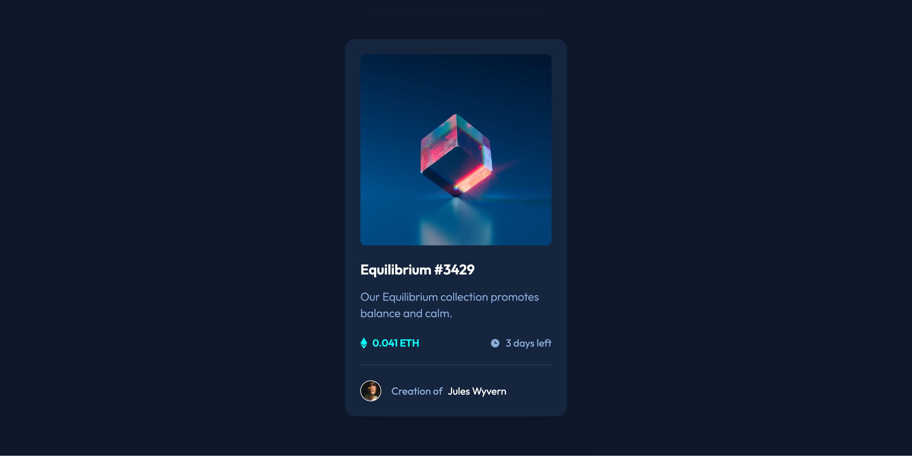

# Frontend Mentor - NFT preview card component solution

This is a solution to the [NFT preview card component challenge on Frontend Mentor](https://www.frontendmentor.io/challenges/nft-preview-card-component-SbdUL_w0U). Frontend Mentor challenges help you improve your coding skills by building realistic projects.

## Table of contents

- [Overview](#overview)
  - [The challenge](#the-challenge)
  - [Screenshot](#screenshot)
  - [Links](#links)
- [My process](#my-process)
  - [Built with](#built-with)
  - [What I learned](#what-i-learned)
  - [Continued development](#continued-development)
- [Author](#author)

**Note: Delete this note and update the table of contents based on what sections you keep.**

## Overview

### The challenge

Users should be able to:

- View the optimal layout depending on their device's screen size
- See hover states for interactive elements

### Screenshot



### Links

- Solution URL: [Add solution URL here](https://your-solution-url.com)
- Live Site URL: [Add live site URL here](https://your-live-site-url.com)

## My process

### Built with

- Semantic HTML5 markup
- CSS custom properties
- Flexbox
- Mobile-first workflow

### What I learned

I learned how to add a backdrop to an image on hover. I used a pseudo element with absolute positioning. I changed the display from none to block upon hover.

```css
.card__hero {
  max-width: 18.875rem;
  position: relative;
  transition: all 0.3s ease;
  cursor: pointer;
}

.card__hero::after {
  content: "";
  width: 100%;
  height: 100%;
  border-radius: 8px;
  opacity: 0.5;
  position: absolute;
  top: 0;
  background-color: var(--color-primary-cyan-400);
  display: none;
}
```

I also learned how to center an icon on top of an image. I set `position: relative` on the parent element, and `position: absolute` on the icon itself. In order to make the centering work regardles of the size of the container (i.e. regardless if it grows or shrinks in size), I set the the top and left properties to 50%. This puts the top-left corner of the icon in the center itself. I then added `transform: translate(-50%, -50%)` to move the icon up and left by half its size. The top and left properties move the element relative to size of the parent container, while the transform property moves it relative to the size of the element itself.

```css
.card__hero-icon {
  width: 3rem;
  position: absolute;
  top: 50%;
  left: 50%;
  transform: translate(-50%, -50%);
  display: none;
}
```

### Continued development

I need to learn more about CSS selectors before my next project.

## Author

- Frontend Mentor - [@yourusername](https://www.frontendmentor.io/profile/Kristina2025)
